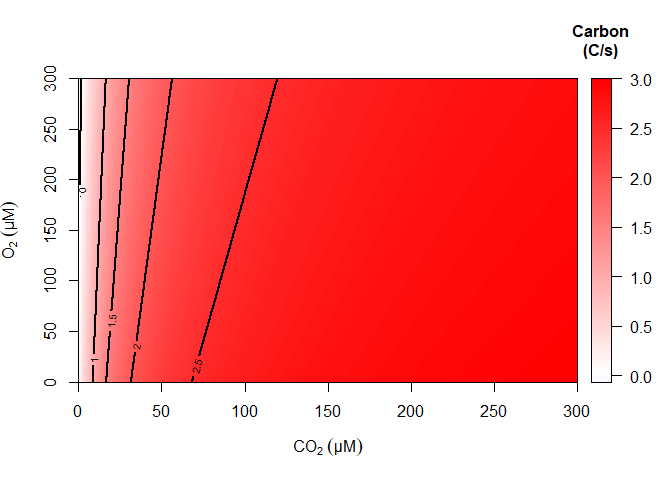

<!-- README.md is generated from README.Rmd. Please edit that file -->

# rbcmodel

<!-- badges: start -->

<!-- badges: end -->

The goal of rbcmodel is to allow easier quantitative evaluation of
ribulose 1,5-bisphosphate carboxylase/oxygenase (Rubisco) net carbon
fixation rates. The package contains a database of ~1500
Michaelis-Menten kinetics (*k*<sub>cat,C</sub>, K<sub>C</sub>,
K<sub>O</sub>, and S<sub>C/O</sub>) measurements and ~200 temperature
scaling factors that can be used to build a Michaelis-Menten function
for a particular Rubisco enzyme. Given a CO<sub>2</sub>, O<sub>2</sub>,
and temperature value, this function provides a rate of net carbon
fixation per active site, including the loss of carbon that results from
the recycling process for the oxygenation product (also called
phosphoglycolate salvage).

## Installation

You can install the CRAN release (v.1.0.0) of rbcmodel from
[CRAN](https://cran.r-project.org/) with:

``` r
install.packages("rbcmodel")
```

Alternately, the development version of rbcmodel can be installed from
[GitHub](https://github.com/) with:

``` r
# install.packages("pak")
pak::pak("keharr/rbcmodel")
```

## Example

To build a Rubisco enzyme, you need three components: the kinetics, the
temperature scaling factors for those kinetics, and a stoichiometry for
the phosphoglycolate salvage.

``` r
library(rbcmodel)
#call kinetics object from database
ex_kinetics<-Enzyme("average_Rubisco")
#call temperature scaling object from database
ex_DHScale<-DHScale("average_Rubisco_dH")
#build enzyme function
ex_Rbc<-CO2_dependence(ex_kinetics,ex_DHScale,PGS="canon")
```

Once the enzyme function is created, it can be used to calculate a
single rate:

``` r
#calculate rate at 150uM CO2, 200uM O2, and 15C
ex_Rbc(150,200,15)
#> [1] 1.204452
```

Or plotted across a 3D grid of values and sliced at one of the three
variables to visualize it:

``` r
#create sequence of the three variables
CO2_seq<-O2_seq<-seq(0,300,by=1)
T_seq<-seq(0,40,by=1)
#create grid
ex_grid<-make_4D_grid(ex_Rbc,CO2_seq,O2_seq,T_seq)
#slice grid at 25C
ex_slice<-slice_4D_grid(ex_grid,dim=3,val=25)
#plot slice
plot_slice_3D(ex_slice,contours=c(0,1,1.5,2,2.5),xlabel=expression(CO[2]~(μM)),ylabel=expression(O[2]~(μM)))
```



An enzyme function can also be compared with any other enzyme function
to calculate or plot the difference in the two rates instead, which is
explored in the basic rbcmodel vignette “Introduction”, which also
contains a more thorough explanation of the basic process of finding
kinetics and a temperature scale to use, creating the enzyme function,
and then creating plots.
